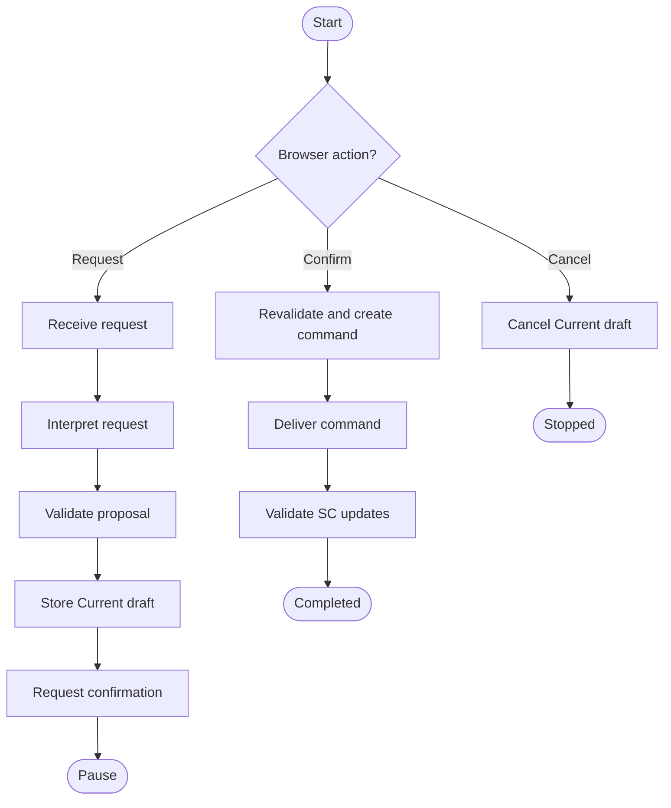

# Controlled typed UCS

This slice exercises one direct typed Arrangement request through a FastAPI
browser interface and a LangGraph workflow. It deliberately uses controlled
adapters at the Ollama and Stacker Controller seams. It does not contact
Ollama, MQTT, a physical controller, or inherited implementation directories.

The controlled adapters are available only through
`ucs_app.create_controlled_app`. The general `ucs_app.create_app` factory has
no adapter defaults, so the controlled behaviour cannot silently become a
production fallback.

## Run the controlled composition

Create an isolated environment and install the declared dependencies:

```bash
python3 -m venv .venv
.venv/bin/python -m pip install -e '.[dev]'
.venv/bin/python -m playwright install chromium
```

Start the UCS from the repository root:

```bash
.venv/bin/uvicorn 'ucs_app.controlled:create_controlled_app' \
  --factory \
  --host 127.0.0.1 \
  --port 8000
```

Open `http://127.0.0.1:8000`, submit a non-empty Arrangement request, inspect
the Current draft, and choose Confirm or Cancel. Confirm is the only route that
creates transport metadata and delivers a validated command. The simulated
success reports execution `COMPLETED` and verification `NOT_RUN`.

## LangGraph workflow

The request and confirmation are separate invocations of the same
checkpointed workflow. This makes the confirmation pause portable to the
project's Python 3.9 environment while preserving an unreachable command path
before confirmation.



FastAPI retains the browser session, invokes the workflow, and streams
browser-safe activity events with Server-Sent Events. The browser receives
validated Target arrangement fields, status, and result summaries; it does
not receive prompts, raw reasoning, MQTT credentials, or unrestricted model
output.

## Verification

The acceptance test launches the live FastAPI interface and drives it with
headless Chromium through browser-visible controls and activity events:

```bash
.venv/bin/pytest tests/test_browser_acceptance.py -q
.venv/bin/mypy
.venv/bin/pytest
```
